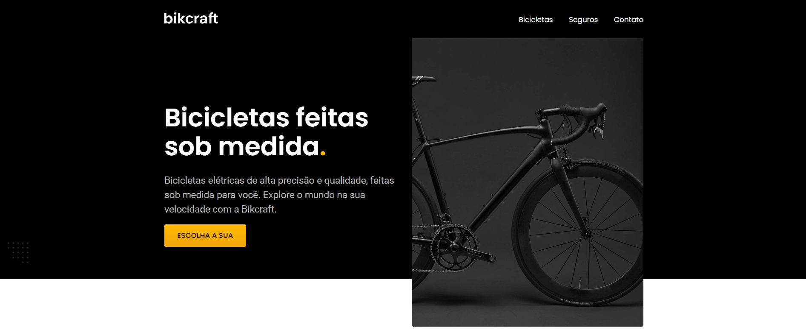

# Bikcraft

Projeto pessoal desenvolvido apenas para praticar. 

Projeto com a ideia de construir um site onde o 
usuário poderá comprar sua própria bicicleta.

### Link do projeto: 

- https://brikcraft-curso-origamid.netlify.app/

## Fotos Ilustrativas: 

## Tecnologias e Dependências

| Name | Link |
| ------ | ------ |
| HTML5 | [https://www.w3schools.com/html/] |
| CSS | [https://www.w3schools.com/css/] |
| JS | [https://developer.mozilla.org/pt-BR/docs/Web/JavaScript] |

